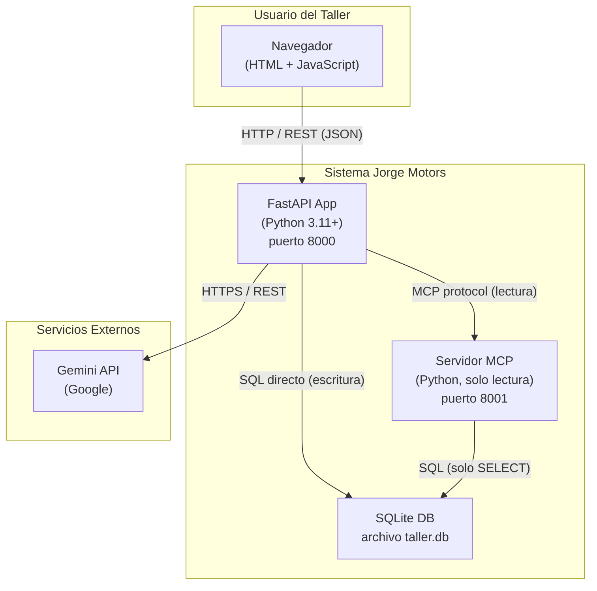
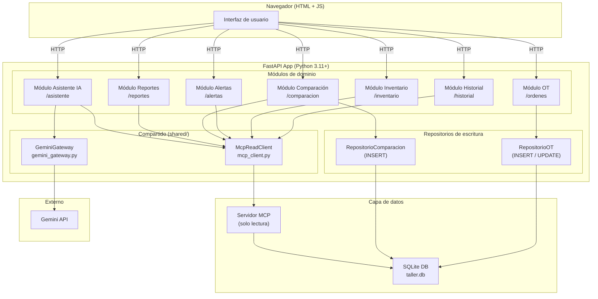
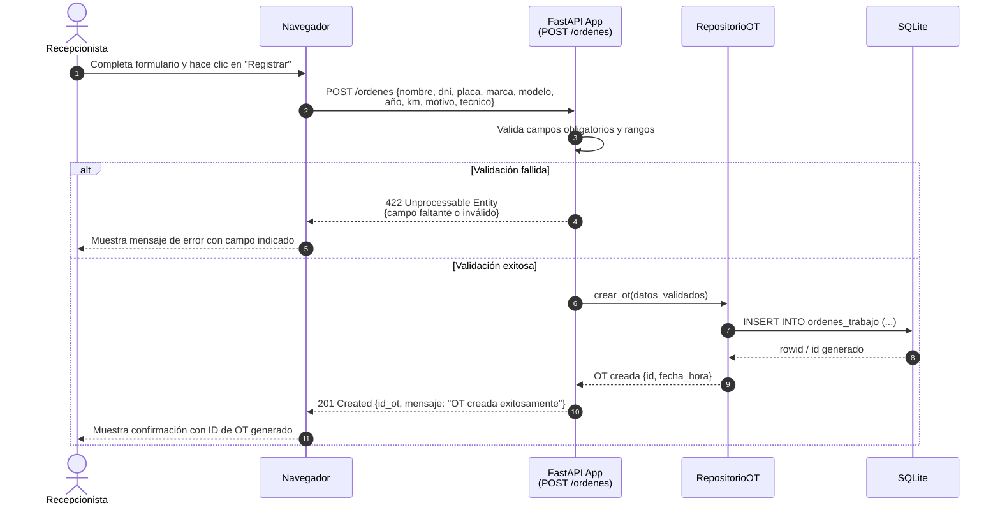
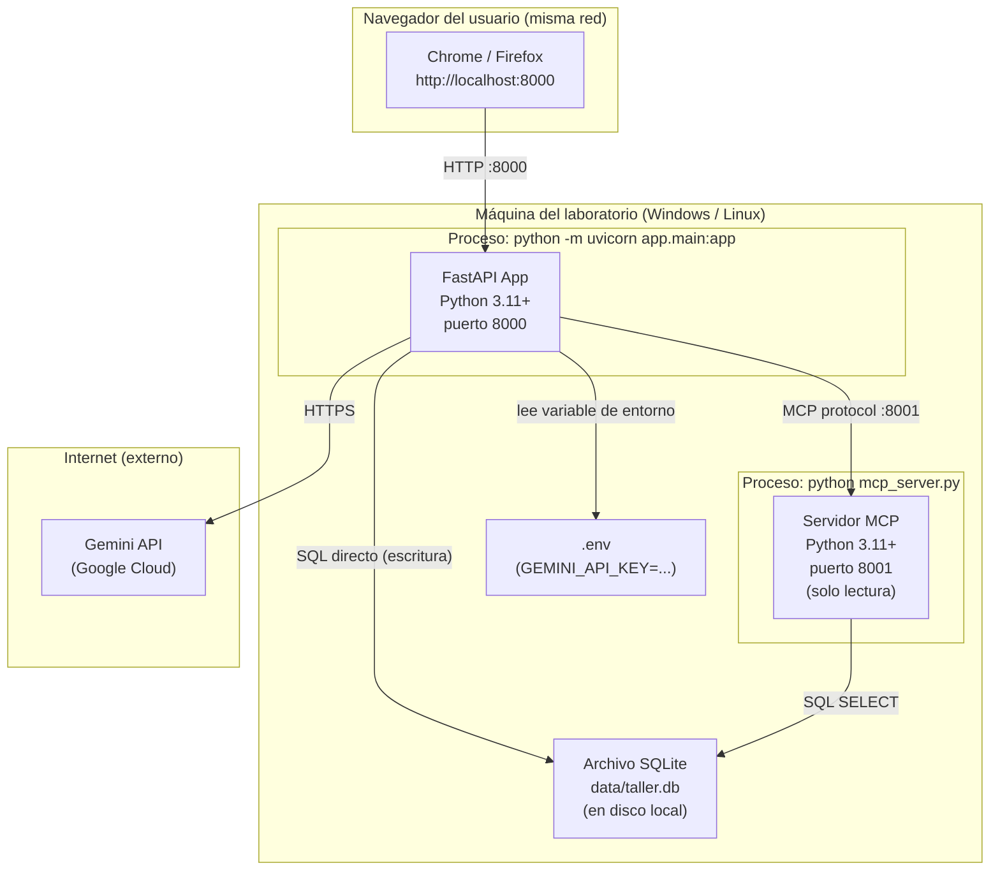

# Design Document

---

## Overview

El sistema es una aplicación web de página única que digitaliza las Órdenes de Trabajo (OT) y el control de inventario de repuestos de Jorge Motors. Está compuesto por un backend FastAPI (Python 3.11+), un frontend HTML + JavaScript simple servido por el mismo proceso, y una base de datos SQLite local. Las lecturas de inventario e historial se canalizan a través de un servidor MCP propio de solo lectura (disponible desde la semana 4); las escrituras se realizan directamente sobre SQLite mediante repositorios internos. La integración con Gemini API se encapsula en un único `GeminiGateway` con degradación controlada: si Gemini falla, el sistema sigue operando con normalidad. Los datos son exclusivamente simulados, en cumplimiento de la Ley N.° 29733.

---

## Architecture



---

### Diagrama C4 Nivel 3 — Componentes



---

### Diagrama de secuencia — Registrar Orden de Trabajo (H1)



---

### Diagrama de despliegue



> **Nota de despliegue:** el proyecto usa Python 3.11+ con `uvicorn` como servidor ASGI. No se utiliza XAMPP, Apache ni MySQL. SQLite opera como archivo local sin servidor separado.

---

## Components and Interfaces

| Componente | Responsabilidad | Carpeta | Historias que satisface |
|---|---|---|---|
| `Módulo OT` | Expone los endpoints de creación y consulta de OT | `app/modules/ordenes/` | H1 |
| `Módulo Historial` | Expone el endpoint de búsqueda del historial por placa o DNI | `app/modules/historial/` | H2 |
| `Módulo Inventario` | Expone el endpoint de consulta de stock de repuestos | `app/modules/inventario/` | H3 |
| `Módulo Alertas` | Calcula y expone la lista de repuestos en alerta de stock mínimo | `app/modules/alertas/` | H4 |
| `Módulo Comparación` | Recibe el conteo físico, consulta el stock registrado y devuelve diferencias con signo | `app/modules/comparacion/` | H5 |
| `Módulo Reportes` | Genera el reporte de OT por técnico en un rango de fechas y produce el CSV | `app/modules/reportes/` | H6 |
| `Módulo Asistente IA` | Orquesta la consulta de contexto al MCP y la llamada a Gemini para respuestas asistidas | `app/modules/asistente/` | H7 (Unidad 3) |
| `McpReadClient` | Único punto de acceso al Servidor MCP de solo lectura; gestiona el protocolo y los errores de disponibilidad | `app/shared/mcp_client.py` | H2, H3, H4, H5, H6, H7 |
| `GeminiGateway` | Único punto de acceso a Gemini API; lee la clave desde variable de entorno, aplica timeout < 30 s y retorna resultado tipado (éxito / "IA no disponible") | `app/shared/gemini_gateway.py` | H7 (Unidad 3) |
| `RepositorioOT` | Ejecuta las escrituras (INSERT/UPDATE) de OT sobre SQLite | `app/modules/ordenes/` | H1 |
| `RepositorioComparacion` | Persiste los resultados del conteo físico en SQLite | `app/modules/comparacion/` | H5 |
| `Frontend HTML + JS` | Interfaz de usuario servida estáticamente; consume la API REST de FastAPI | `frontend/` | H1–H6 |
| `taller.db` | Base de datos SQLite con datos simulados de clientes, vehículos, repuestos y stock | `data/taller.db` | Todos |

**Estructura de carpetas propuesta:**

```
asistente_taller/
  app/
    main.py
    modules/
      ordenes/
      historial/
      inventario/
      alertas/
      comparacion/
      reportes/
      asistente/
    shared/
      mcp_client.py
      gemini_gateway.py
  frontend/
    index.html
    static/
  data/
    taller.db
  tests/
  docs/
  .env.example
```

---

### Punto de extensión para la Unidad 3

Cuando en la Unidad 3 se integre el agente de IA, los dos puntos de conexión naturales ya están definidos en la arquitectura actual:

- **`GeminiGateway`** (`app/shared/gemini_gateway.py`): es la única clase que se comunica con Gemini API. El agente de IA utilizará este mismo gateway para emitir sus prompts y recibir respuestas, sin necesidad de crear una nueva vía de comunicación con la API externa.

- **`McpReadClient`** (`app/shared/mcp_client.py`): es el único componente que consulta el inventario e historial a través del Servidor MCP. El agente necesitará acceder a esos datos como contexto; lo hará a través de este cliente, sin modificar los módulos de dominio existentes.

El `Módulo Asistente IA` (`app/modules/asistente/`) actúa como orquestador: recibirá la consulta del usuario, pedirá contexto a `McpReadClient` y delegará la generación de respuesta a `GeminiGateway`. El diseño detallado del agente, sus prompts, su lógica de orquestación y sus herramientas se definirán en la Unidad 3.

---

### Decisiones no tomadas

Las siguientes decisiones quedan pendientes para el diseño detallado de cada módulo:

- **Esquema de tablas SQLite**: nombres exactos de columnas, tipos de dato, restricciones de clave foránea e índices de las tablas `ordenes_trabajo`, `repuestos`, `stock`, `clientes`, `vehiculos` y `trazabilidad`.
- **Contratos de la API REST**: rutas exactas, parámetros de consulta, cuerpos de solicitud y esquemas de respuesta (modelos Pydantic) para todos los endpoints.
- **Formato exacto del CSV de exportación**: codificación de caracteres, delimitador, manejo de tildes y ñ, cabeceras en español.
- **Manejo de concurrencia en SQLite**: configuración del modo WAL (*Write-Ahead Logging*) para que las lecturas del MCP y las escrituras de FastAPI coexistan sin bloqueos (identificado como riesgo en ADR-002).
- **Valor del timeout de GeminiGateway**: el ADR-003 propone 20 s como valor inicial; debe medirse y confirmarse antes de la semana 7.
- **Estrategia de paginación**: si la consulta de historial puede devolver más de 100 OT, cómo se trunca o pagina el resultado.
- **Formato del log de trazabilidad**: estructura exacta de la tabla o archivo donde se almacenan las entradas de consultas asistidas por IA (Requisito 9).
- **Valores del stock mínimo simulado**: rango de valores para el campo `stock_minimo` en los datos de prueba de `taller.db`.
- **Rol de usuario en la interfaz**: cómo el usuario selecciona su rol (Recepcionista, Técnico, Encargado_Compras, Gerente) sin autenticación — deuda técnica aceptada en ADR-002.

---

## Data Models

Los modelos de datos detallados (esquema de tablas SQLite, tipos de columna, restricciones) se definirán en el diseño detallado de cada módulo. Ver sección 'Decisiones no tomadas'.

## Correctness Properties

*Una propiedad es una característica o comportamiento que debe mantenerse verdadero en todas las ejecuciones válidas del sistema — esencialmente, una afirmación formal sobre lo que el sistema debe hacer. Las propiedades sirven como puente entre las especificaciones legibles por humanos y las garantías de corrección verificables automáticamente.*

### Property 1: Unicidad de identificadores de OT

*Para cualquier* conjunto de N Órdenes de Trabajo creadas en el sistema, todos sus identificadores deben ser distintos entre sí (sin colisiones).

**Validates: Requirements 1.2**

---

### Property 2: Round-trip de campos obligatorios de OT

*Para cualquier* OT creada con datos válidos generados aleatoriamente, recuperar esa OT del sistema debe retornar exactamente los mismos valores enviados en todos los campos obligatorios (nombre, DNI, placa, marca, modelo, año, km, motivo, técnico asignado y fecha/hora de creación).

**Validates: Requirements 1.3**

---

### Property 3: Rechazo de OT con campos obligatorios faltantes

*Para cualquier* subconjunto propio de los campos obligatorios de una OT (es decir, con al menos un campo omitido), el endpoint de creación debe retornar un error de validación y no incrementar el número de OT en el sistema.

**Validates: Requirements 1.4**

---

### Property 4: Límite y orden del historial de OT

*Para cualquier* historial con N OT asociadas a una placa o DNI (N ≥ 0), la búsqueda debe retornar como máximo 100 registros; si N ≤ 100, retorna exactamente N; las OT retornadas deben ser las N más recientes según su fecha de creación.

**Validates: Requirements 2.1**

---

### Property 5: Completitud de campos al consultar una OT del historial

*Para cualquier* OT almacenada en el sistema, recuperarla por identificador debe retornar un objeto que contenga exactamente los seis campos definidos: identificador de OT, fecha, motivo de ingreso, técnico asignado, estado y observaciones técnicas.

**Validates: Requirements 2.2**

---

### Property 6: Rechazo de búsqueda con formato inválido

*Para cualquier* cadena de texto que no cumpla el formato de placa (máximo 8 caracteres alfanuméricos) ni el formato de DNI (exactamente 8 dígitos numéricos), el endpoint de búsqueda de historial debe retornar un error de validación sin ejecutar la consulta al servidor MCP.

**Validates: Requirements 2.5**

---

### Property 7: Completitud e inmutabilidad de la consulta de stock

*Para cualquier* repuesto existente en el inventario, consultar su stock debe: (a) retornar un objeto con exactamente los cuatro campos definidos (nombre, código, cantidad disponible, unidad de medida) y (b) no modificar la cantidad registrada en el inventario tras la consulta.

**Validates: Requirements 3.2**

---

### Property 8: Exactitud de búsqueda por código de repuesto

*Para cualquier* código que exista en el inventario, la búsqueda por ese código debe retornar exactamente un resultado cuyo campo código coincida de forma exacta con el código buscado.

**Validates: Requirements 3.3**

---

### Property 9: Completitud de resultados en búsqueda por nombre de repuesto

*Para cualquier* término de búsqueda por nombre que coincida con K repuestos en el inventario (K ≥ 1), el resultado debe contener exactamente esos K repuestos y ningún repuesto adicional cuyo nombre no coincida.

**Validates: Requirements 3.4**

---

### Property 10: Rechazo de consulta de stock con entrada vacía o de solo espacios

*Para cualquier* cadena de texto que sea vacía o esté compuesta únicamente por espacios en blanco, el endpoint de consulta de stock debe retornar un error de validación sin ejecutar la consulta al servidor MCP.

**Validates: Requirements 3.7**

---

### Property 11: Corrección del filtrado de alertas de stock mínimo

*Para cualquier* inventario con N repuestos (cantidades y stocks mínimos generados aleatoriamente), la lista de alertas debe contener exactamente aquellos repuestos cuya cantidad disponible sea menor o igual a su stock mínimo configurado, incluyendo todos los campos requeridos (nombre, código, cantidad actual, stock mínimo).

**Validates: Requirements 4.1, 4.2**

---

### Property 12: Corrección del cálculo de diferencias en comparación de conteo físico

*Para cualquier* par de valores enteros no negativos (conteo_físico, cantidad_sistema), la diferencia calculada por el sistema debe ser exactamente `conteo_físico − cantidad_sistema`, retornada como entero con signo, y el resultado debe incluir los cinco campos definidos: nombre, código, cantidad del sistema, cantidad del conteo físico y diferencia.

**Validates: Requirements 5.1, 5.2**

---

### Property 13: Clasificación correcta del indicador de descuadre

*Para cualquier* resultado de comparación donde la diferencia es distinta de cero, el repuesto debe llevar el indicador de descuadre; cuando la diferencia es cero, no debe llevar ese indicador.

**Validates: Requirements 5.3**

---

### Property 14: Filtrado correcto de OT por rango de fechas en el reporte

*Para cualquier* rango de fechas válido `[fecha_inicio, fecha_fin]` (ambos extremos inclusivos), todas las OT incluidas en el reporte deben tener fecha de creación mayor o igual a `fecha_inicio` y menor o igual a `fecha_fin`; ninguna OT fuera del rango debe aparecer en el reporte.

**Validates: Requirements 6.1, 6.2**

---

### Property 15: Rechazo de rango de fechas inválido en el reporte

*Para cualquier* par de fechas donde `fecha_inicio` sea posterior a `fecha_fin`, el endpoint de reportes debe retornar un error de validación sin consultar el servidor MCP.

**Validates: Requirements 6.4**

---

### Property 16: Completitud y consistencia del CSV exportado

*Para cualquier* reporte generado exitosamente, el archivo CSV debe contener exactamente las cinco columnas requeridas (nombre del técnico, total de OT, OT abiertas, OT en proceso, OT cerradas), y para cada fila la suma `abierta + en_proceso + cerrada` debe ser igual al total de OT del técnico en ese período.

**Validates: Requirements 6.5**

---

### Property 17: Completitud y unicidad del log de trazabilidad de IA

*Para cualquier* conjunto de N consultas asistidas por Gemini API procesadas por el sistema, cada entrada del log debe contener los seis campos requeridos (ID único, timestamp ISO 8601, rol del usuario, pregunta, contexto MCP utilizado y respuesta generada), y los N identificadores de entrada deben ser todos distintos entre sí.

**Validates: Requirements 9.1, 9.2**

---

## Error Handling

| Situación | Código HTTP | Respuesta al cliente | Comportamiento interno |
|---|---|---|---|
| Campo obligatorio faltante o inválido en OT | 422 | `{detail: "campo X es requerido / inválido"}` | No se persiste nada; se devuelven los datos ingresados para reintento |
| Servidor MCP no disponible | 503 | `{detail: "Servicio de inventario/historial no disponible en este momento"}` | Se registra el error en el log del proceso; no se expone la causa técnica |
| Gemini API no disponible o timeout | 200 (degradado) | `{asistencia: null, mensaje: "Asistencia de IA no disponible en este momento"}` | GeminiGateway retorna resultado tipado de error; el módulo Asistente IA continúa operando con degradación |
| Variable de entorno `GEMINI_API_KEY` ausente al arrancar | — | Mensaje genérico en la UI: "Servicio no disponible" | El proceso termina con código de salida distinto de cero y registra error de configuración en el log |
| Operación supera 2 segundos sin respuesta | — | Spinner/barra de progreso visible en el navegador | El frontend muestra el indicador de carga hasta recibir respuesta o hasta el timeout de 30 s |
| Operación supera 30 segundos sin respuesta | — | Mensaje de error con opción de reintentar | El frontend oculta el spinner y ofrece al usuario la opción de reintento |
| Búsqueda con entrada vacía o formato inválido | 422 | `{detail: "Formato inválido. Use placa (máx. 8 car. alfanuméricos) o DNI (8 dígitos)"}` | No se ejecuta ninguna consulta al MCP |
| Rango de fechas inválido (inicio > fin) | 422 | `{detail: "La fecha de inicio no puede ser posterior a la fecha de fin"}` | No se genera el reporte |
| Repuesto no encontrado en el inventario | 200 | `{resultados: [], mensaje: "Repuesto no encontrado"}` | No se ejecuta ninguna escritura |

---

## Testing Strategy

### Enfoque dual

La estrategia combina pruebas basadas en ejemplos (unitarias e integración) con pruebas basadas en propiedades (PBT) para lograr cobertura complementaria: las pruebas de ejemplo validan comportamientos concretos y condiciones de borde, mientras que las pruebas de propiedades verifican invariantes universales sobre espacios de entrada amplios.

### Pruebas unitarias y de integración

Se usan para:
- Verificar comportamientos específicos y condiciones de borde (listas vacías, repuesto inexistente, rango de fechas sin OT).
- Validar el manejo de fallos de dependencias externas (MCP no disponible, Gemini con error) mediante mocks de `McpReadClient` y `GeminiGateway`.
- Confirmar el comportamiento de arranque cuando `GEMINI_API_KEY` no está definida.
- Verificar la generación del indicador de carga en el frontend para operaciones lentas.

Herramienta: `pytest` con `httpx` para pruebas de los endpoints FastAPI.

### Pruebas basadas en propiedades (PBT)

Se aplican a las 17 propiedades definidas en la sección anterior. Cada prueba de propiedad se ejecuta con un mínimo de 100 iteraciones sobre datos generados aleatoriamente.

Herramienta: **Hypothesis** (biblioteca de PBT estándar para Python).

Cada prueba de propiedad debe incluir un comentario de etiqueta en el formato:

```
# Feature: asistente-taller-jorge-motors, Propiedad N: <texto de la propiedad>
```

Las propiedades que involucran consultas al MCP o llamadas a Gemini usan mocks para mantener las pruebas rápidas y deterministas. Las pruebas de integración end-to-end con el MCP real se reservan para la semana 4 cuando el servidor MCP esté disponible.

### Pruebas de humo (*smoke tests*)

- Verificar que el proceso arranca correctamente con la variable `GEMINI_API_KEY` definida.
- Verificar que el proceso termina con código distinto de cero cuando `GEMINI_API_KEY` no está definida.
- Revisión documental de `data/taller.db` para confirmar que no contiene datos reales de personas.

### Cobertura mínima esperada

| Módulo | Tipo de prueba prioritaria |
|---|---|
| `RepositorioOT` | PBT (Propiedades 1, 2, 3) + integración |
| `Módulo Historial` | PBT (Propiedades 4, 5, 6) + integración con mock MCP |
| `Módulo Inventario` | PBT (Propiedades 7, 8, 9, 10) + integración con mock MCP |
| `Módulo Alertas` | PBT (Propiedad 11) + ejemplo (lista vacía) |
| `Módulo Comparación` | PBT (Propiedades 12, 13) + ejemplo (repuesto inexistente) |
| `Módulo Reportes` | PBT (Propiedades 14, 15, 16) + integración con mock MCP |
| `GeminiGateway` | Integración con mock (error, timeout, éxito) |
| `Módulo Asistente IA` | PBT (Propiedad 17) + integración con mock Gemini |
